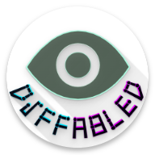

  <a href="https://aamirazeez.com/story/diffabled">
    
    <h2 align="center">DiffAbled</h2>
  </a>
  

Allows the blind to learn braille independently!

[Read the story behind DiffAbled](https://aamirazeez.com/story/diffabled)

# Note
I'm new to Flutter and Dart, so you may find some mistakes, bugs, or unoptimized code in my repository.
If you notice any issues, please feel free to create a pull request. I appreciate your help and feedback!

[DiffAbled Privacy Policy](https://aamirazeez.com/policy/diffabled)

# ChangeLog
### 1.2.5 (24-Aug-2024)
- Patched sharedpreferences boolean getting set to the wrong default value.
### 1.2.4 (23-Aug-2024) Github Upload:
- Compressed image and audio assets.
- Changed audio format from WAV (PCM codec) to FLAC (FLAC codec).
- Uploaded to GitHub!
### 1.2.3 (22-Aug-2024):
- Added "Do not show again" checkbox in popup.
- New dependency for local storage: shared_preferences.
### 1.2.2 (20-Aug-2024):
- More colors!
- Added "Help" button.
- Cleaned up directories for GitHub upload.
### 1.2.1 (18-Aug-2024):
- Patched AppBar sizing bug. Heading area resizes responsively now.
## 1.2.0 (17-Aug-2024) Responsive Sizing:
- Implemented responsive design to fix sizing issues recieved from closed testing feedback.
- All parts of UI (text, buttons, images) scale similarly on all devices.
- App now supports landscape mode and tablets.

## 1.1.0 (21-Jul-2024):
- Updated target Android API Level (target SDK version) to Android API Level 35.
- Updated components.
- Updated App to be compatible with Google Play Store policy changes.
- Cleaned up and refactored old code.

## 1.0.0 (16-Feb-2023) Released for Innotech:
- Silver medallist in Innotech (solo programming category).
- Learnt Flutter and the Dart programming language in less than a week to meet deadline.

[Repository License](/LICENSE)
